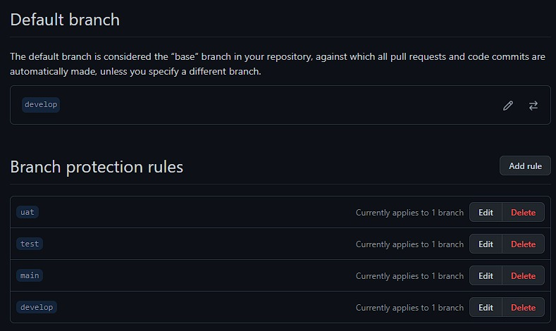
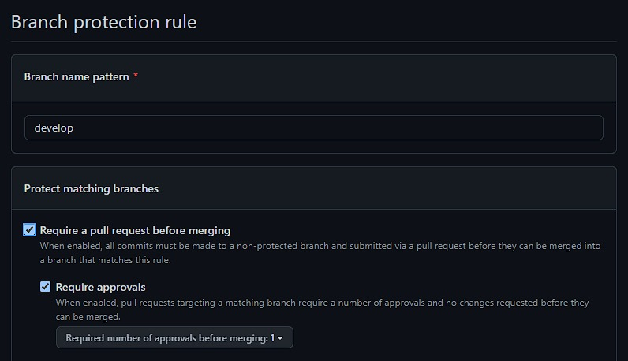
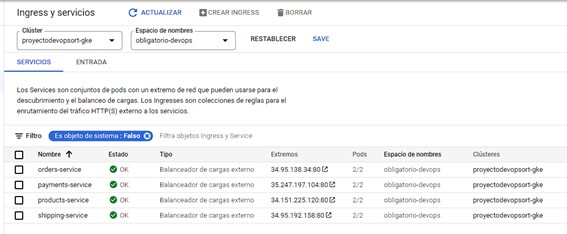
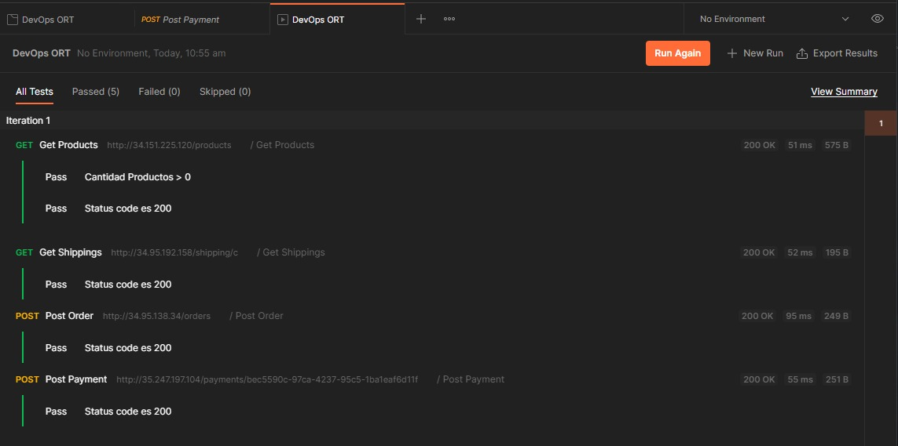

# Obligatorio DevOps 2022

## Presentación del problema

Una empresa del sector retail desea modernizar la forma en que desarrollan y realizan el
delivery del software de su plataforma. Para esto, uno de sus “C-Levels” propone impulsar un
modelo DevOps con el fin de mejorar el time-to-market y calidad del software desarrollado
in-house.
Se ha conformado un equipo de trabajo multidisciplinario con la tarea de promover y llevar a
cabo este proceso de modernización a las áreas de desarrollo, calidad y operación. Además,
la empresa tiene interés en explorar estrategias de automatización y escalabilidad para el
despliegue de sus aplicaciones.
Entre las principales tareas del equipo, deberán de analizar distintas herramientas para lograr
los objetivos expresados, además de la implementación y documentación del proyecto.

## Solución propuesta por el equipo  

Optamos por un GitFlow con 4 ramas estables, 1 por ambiente:
• Develop
• Test
• UAT
• Main (Producción)  

Los nuevos requerimientos se trabajarán en ramas con el prefijo “Feature” que se deberán incorporar a Develop mediante Pull Request.  

  

Desde Develop, cuando se tenga una cantidad determinada de requerimientos completos, se realizará un deploy a Test.
El equipo de Testing será el responsable de dar su aprovacion de los requerimientos incorporados a esta rama. En caso de que no se detecten errores, estos solicitaran que los cambios se incorporen desde test a UAT y se solicitara al cliente que realice pruebas.  

En caso de encontrar algún bug, se abrirá una rama “BugFix”, luego de realizar este desarrollo, se incorporará el cambio tanto de Develop como a Test.  

Si el cliente detectase un error en el ambiente de UAT, el procedimiento de Fix se realizará desde la rama de test. Para que pueda ser validado por el equipo de test previo a que se realice un nuevo deploy a UAT.

Finalmente, si se da el visto bueno a la versión en UAT, se realizará un merge desde UAT a Main.  

Si se encontrase un bug en producción que fuera critico para el cliente, se realizara una rama Hotfix directamente desde main para corregir el error. Una vez solucionado, este fix deberá ser incorporado al resto de las ramas estables.

En cada proyecto, se establecieron reglas para no permitir push directos sobre las ramas
estables, necesitándose siempre realizar una rama alternativa que se incorporara a las estables.  

  

Además, para cada Pull Request se solicita la aprobación de otro miembro del equipo de desarrollo  

Se decidió utilizar GitHub como repositorio de código. En la plataforma creamos 1 repositorio para cada uno de los 4 microservicios y uno separado para el código de infra.  

  

Nos decidimos por la utilización de GitHub Actions como plataforma de integración y despliegue continuo (CI/CD). Esto nos permitió automatizar el mapa de compilación, pruebas y despliegue.  

Para evitar que el equipo de desarrollo pudiese modificar el flujo, se definió una acción reutilizable en el repositorio de infra que es invocada con cada push por los repositorios de cada microservicio.  

Este Flujo consta de 4 pasos:  
• Build  
• Test (utilizando SonarCloud)  
• Image Build y Push a GCP Artifact Registry  
• Commit del nuevo Tag de imagen al repo de infra.  

Los 2 últimos pasos se realizan únicamente cuando se estén modificando ramas estables.  

Para gestionar IaC optamos por Terraform que nos permiten codificar la infraestructura desplegada en GCP y que este código sea ejecutado hasta lograr que esta sea aprovisionada y configurada.  

Como servicio cloud decidimos trabajar con el servicio de Google Cloud Platform (GCP) que brinda una cuenta de aprendizaje con 300 dólares de crédito para utilizar. Los recursos utilizados fueron:  

• Artifact Registry - nos proporciona una única ubicación para almacenar y administrar los paquetes y las imágenes de contenedores de Docker.  

• Google Kubernetes Engine (GKE) - como Cluster de Kubernetes. Esto nos ofrece múltiples ventajas y una de ellas es que las aplicaciones son independientes entre sí, por lo que el rendimiento de cada aplicación es mayor.  

Para el despliegue sobre GKE elegimos ArgoCD que funciona de forma declarativa.
Luego de realizar una investigación y varias pruebas optamos por realizar la instalación de ArgoCD en nuestro Cluster de manera manual. Le decisión se tomo en primera instancia porque es muy sencillo realizar esta instalación de manera manual siguiendo la documentación del proveedor y en segundo lugar porque no encontramos una manera sencilla de realizar esto de manera automatizada. En la actualidad Terraform no posee un medio para aprovisionar esta instalación y si bien hay algunos módulos realizados por usuarios, la complejidad con la que nos encontramos no era un ahorro de tiempo comparado con la instalación manual.

Una vez levantado, ArgoCD realiza el deploy del ambiente Develop en el clúster, y monitorea este regularmente comparándolo con el clúster. Se configuro de tal manera que en caso de detectar un cambio (falta de sincronía) entre el clúster y los manifiesto en GitHub, aplicara dichos cambios de manera automática sobre el clúster.  

  

Optamos por configurar los servicios como LoadBalancer para aprovechar el aprovisionamiento de IP balanceo de carga nativo de GCP.  

### Informes de pruebas realizadas

#### Sonarcloud  

Como herramienta de análisis de código estático trabajamos con Sonarcloud. Actualmente tenemos configurado el Quality Gates por defecto, para mejorar los resultados deberíamos trabajar en la implementación de más y mejores pruebas unitarias, corregir bugs, detección de código duplicado, agregar comentarios pertinentes en el código, evitar el código spaghetti y corregir posibles vulnerabilidades conocidas de seguridad.  

En caso de que falle el test de se detiene el flujo de trabajo evitando que los errores lleguen a la etapa final de despliegue.

  

### Postman  

Para pruebas de la aplicación ya desplegada utilizamos Postman. El objetivo de estas pruebas es el mismo que cualquier otro tipo de prueba: la detección de errores. Pero la perspectiva end to end nos permite dar un paso más y, aparte de errores con una visibilidad más o menos inmediata, podremos determinar la existencia de indefiniciones funcionales.  

Actualmente las pruebas se corren manualmente desde Postman, creamos una colección que ejecuta las pruebas. Como mejoras se podrían realizar distintas pruebas para cada microservicio, actualmente las pruebas básicamente comprueban el status code en 200. Además, se podrían automatizar y ejecutarlas antes para detectar errores y frenar el flujo de trabajo si fuera necesario.  

  
