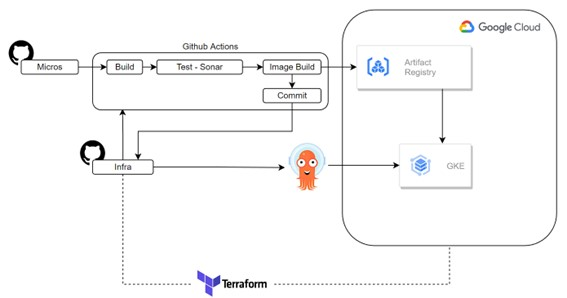

# Obligatorio DevOps 2022

## Presentación del problema

Una empresa del sector retail desea modernizar la forma en que desarrollan y realizan el
delivery del software de su plataforma. Para esto, uno de sus “C-Levels” propone impulsar un
modelo DevOps con el fin de mejorar el time-to-market y calidad del software desarrollado
in-house.
Se ha conformado un equipo de trabajo multidisciplinario con la tarea de promover y llevar a
cabo este proceso de modernización a las áreas de desarrollo, calidad y operación. Además,
la empresa tiene interés en explorar estrategias de automatización y escalabilidad para el
despliegue de sus aplicaciones.
Entre las principales tareas del equipo, deberán de analizar distintas herramientas para lograr
los objetivos expresados, además de la implementación y documentación del proyecto.

## Solución propuesta por el equipo

Separamos la solución en un repositorio para cada microservicio y un repositorio encargado de la parte de infra.
Nos decidimos por la utilización de GitHub Actions como plataforma de integración y despliegue continuos (CI/CD) que nos permitieron automatizar el mapa de compilación, pruebas y despliegue.
El ciclo de integración y delivery cuenta con los siguientes ambientes: Develop, Testing, Uat y Main.

Para gestionar IaC optamos por Terraform que nos permiten codificar la infraestructura que queremos y que este código sea ejecutado hasta lograr que esta sea aprovisionada y configurada. Como servicio cloud decidimos trabajar con el servicio de Google Cloud Platform (GCP) que brinda una cuenta de aprendizaje con 300 dólares de crédito para utilizar. Básicamente los recursos que utilizamos son:

Artifact Registry nos proporciona una única ubicación para almacenar y administrar los paquetes y las imágenes de contenedores de Docker.

Google Kubernetes Engine (GKE) nos permite tener un entorno en contenedores. Esto nos ofrece múltiples ventajas y una de ellas es que las aplicaciones son independientes entre sí, por lo que el rendimiento de cada aplicación es mayor.

Como herramienta de despliegue continuo elegimos ArgoCD que funciona de forma declarativa. Se puede instalar en un clúster de Kubernetes y puede desplegar aplicaciones en el mismo clúster o en otros clústers, permitiendo así gestionar de forma centralizada y automática el despliegue.

Como herramienta de análisis de código estático trabajamos con SonarCloud. Como mejoras para las pruebas se podrían realizar test unitarios en cada uno de los microservicios desplegados y tener mayor cubertura en el análisis.

Para pruebas de la aplicación ya desplegada utilizamos Postman. El objetivo de estas pruebas es el mismo que cualquier otro tipo de prueba: la detección de errores. Pero la perspectiva end to end nos permite dar un paso más y, aparte de errores con una visibilidad más o menos inmediata, podremos determinar la existencia de indefiniciones funcionales.

## Diagramas

### Diagrama Git Flow

  

### Diagrama CICD

## Informes de pruebas realizadas

### Sonarcloud

### Postman

  

  

  

  

